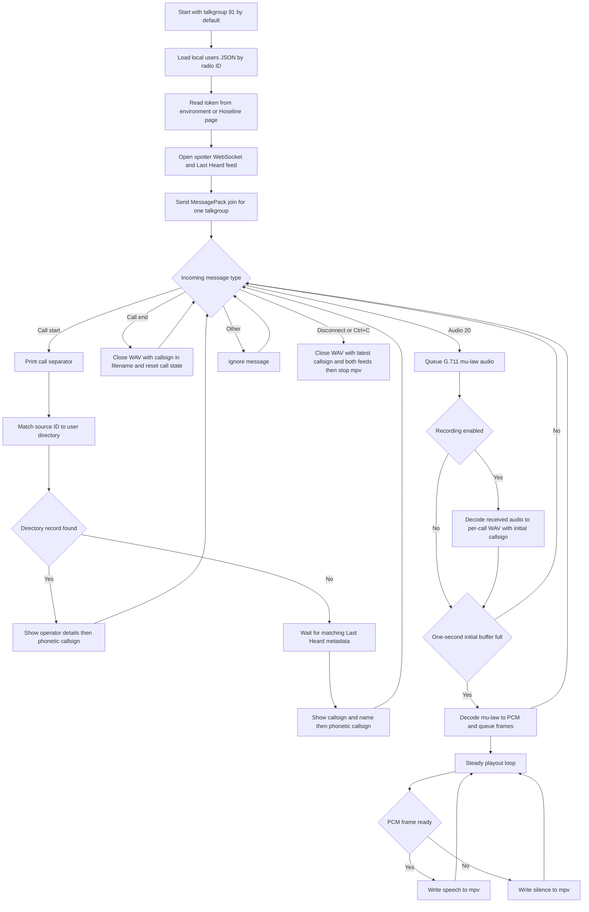

# Hoseline playback flow

```mermaid
flowchart TD
    A[Start with talkgroup 91 by default] --> U[Load local users JSON by radio ID]
    U --> B[Read token from environment or Hoseline page]
    B --> C[Open spotter WebSocket and Last Heard feed]
    C --> D[Send MessagePack join for one talkgroup]
    D --> E{Incoming message type}
    E -->|Call start| X[Print call separator]
    X --> F[Match source ID to user directory]
    F --> Q{Directory record found}
    Q -->|Yes| R[Show operator details then phonetic callsign]
    Q -->|No| S[Wait for matching Last Heard metadata]
    S --> T[Show callsign and name then phonetic callsign]
    E -->|Call end| P[Close WAV with callsign in filename and reset call state]
    E -->|Audio 20| G[Queue G.711 mu-law audio]
    G --> V{Recording enabled}
    V -->|Yes| W[Decode received audio to per-call WAV with initial callsign]
    V -->|No| K
    W --> K
    K{One-second initial buffer full}
    K -->|No| E
    K -->|Yes| L[Decode mu-law to PCM and queue frames]
    E -->|Other| H[Ignore message]
    R --> E
    T --> E
    P --> E
    L --> I[Steady playout loop]
    I --> M{PCM frame ready}
    M -->|Yes| N[Write speech to mpv]
    M -->|No| O[Write silence to mpv]
    N --> I
    O --> I
    L --> E
    H --> E
    E -->|Disconnect or Ctrl+C| J[Close WAV with latest callsign and both feeds then stop mpv]
```
