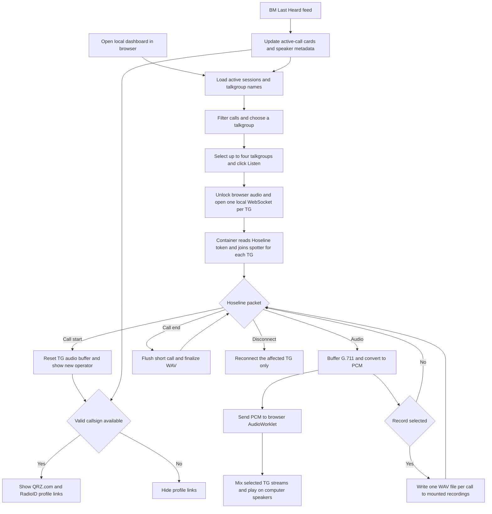

# Local Hoseline dashboard flow

```mermaid
flowchart TD
    A[Open local dashboard in browser] --> B[Load active sessions and talkgroup names]
    B --> C[Filter calls and choose a talkgroup]
    C --> D[Select up to four talkgroups and click Listen]
    D --> E[Unlock browser audio and open one local WebSocket per TG]
    E --> F[Container reads Hoseline token and joins spotter for each TG]
    F --> G{Hoseline packet}
    G -->|Call start| H[Reset TG audio buffer and show new operator]
    H --> R{Valid callsign available}
    R -->|Yes| S[Show QRZ.com and RadioID profile links]
    R -->|No| T[Hide profile links]
    G -->|Audio| I[Buffer G.711 and convert to PCM]
    I --> J[Send PCM to browser AudioWorklet]
    J --> K[Mix selected TG streams and play on computer speakers]
    I --> L{Record selected}
    L -->|Yes| M[Write one WAV file per call to mounted recordings]
    L -->|No| G
    M --> G
    G -->|Call end| N[Flush short call and finalize WAV]
    N --> G
    G -->|Disconnect| O[Reconnect the affected TG only]
    P[BM Last Heard feed] --> Q[Update active-call cards and speaker metadata]
    Q --> B
    Q --> R
```
